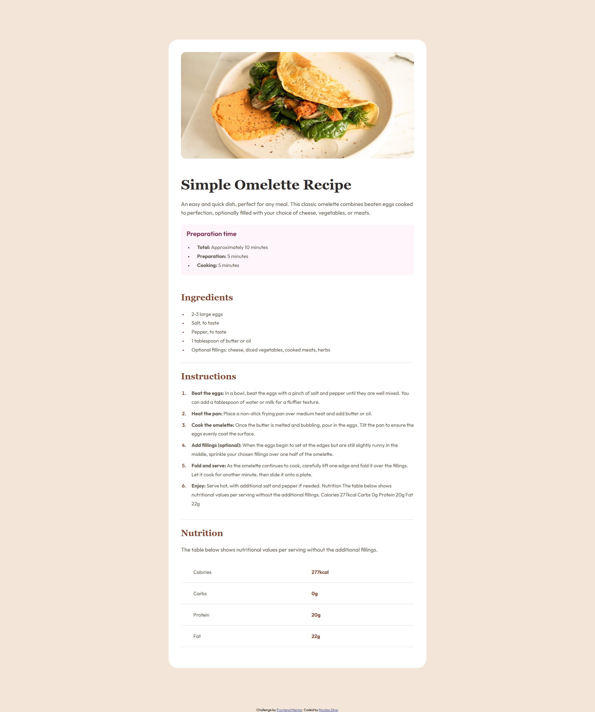

# Frontend Mentor - Recipe page solution

This is a solution to the [Recipe page challenge on Frontend Mentor](https://www.frontendmentor.io/challenges/recipe-page-KiTsR8QQKm). Frontend Mentor challenges help you improve your coding skills by building realistic projects.

## Table of contents

- [Overview](#overview)
  - [The challenge](#the-challenge)
  - [Screenshot](#screenshot)
  - [Links](#links)
- [My process](#my-process)
  - [Built with](#built-with)
  - [What I learned](#what-i-learned)

## Overview

### Screenshot

### Links

- Live Site URL: [Recipe Page](https://recipe-page-git-main-nicos-projects-6ccc3aaa.vercel.app/)

## My process

### Built with

- Semantic HTML5 markup
- CSS custom properties
- Flexbox
- Mobile-first workflow

## What I Learned

In this project, I reinforced my foundational web development skills and implemented modern CSS techniques. Here is a summary of the key learnings:

### 1. Semantic HTML5

- **Meaningful Structure:** Used `<section>`, `<table>`, and `<tbody>` to ensure the content is accessible and well-structured for screen readers and SEO.
- **Data Presentation:** Properly implemented tabular data for nutritional facts, using `<th>` for headers and `<td>` for values.

### 2. Modern CSS Architecture

- **CSS Variables (`:root`):** Centralized the color palette and typography to maintain consistency and allow for easy global updates.
- **Typography:** Implemented custom Google Fonts via `@font-face` with `font-display: swap` for better performance.
- **Logical Properties:** Used modern properties like `padding-inline` and `margin-block` to handle spacing more efficiently.

### 3. Responsive Design & Layout

- **Flexbox:** Utilized Flexbox to center the main card and align content within the recipe sections.
- **Mobile-First Approach:** Developed a fully responsive layout using Media Queries and relative units (`rem`, `em`) to ensure the design scales across all devices.
- **Box Model:** Applied `box-sizing: border-box` to prevent padding from affecting the overall element width.

### 4. Advanced UI Styling

- **Custom Markers:** Used the `::marker` pseudo-element to customize the color and weight of bullet points and list numbers.
- **Image Optimization:** Applied responsive image techniques and `border-radius` to maintain a clean, modern aesthetic.
